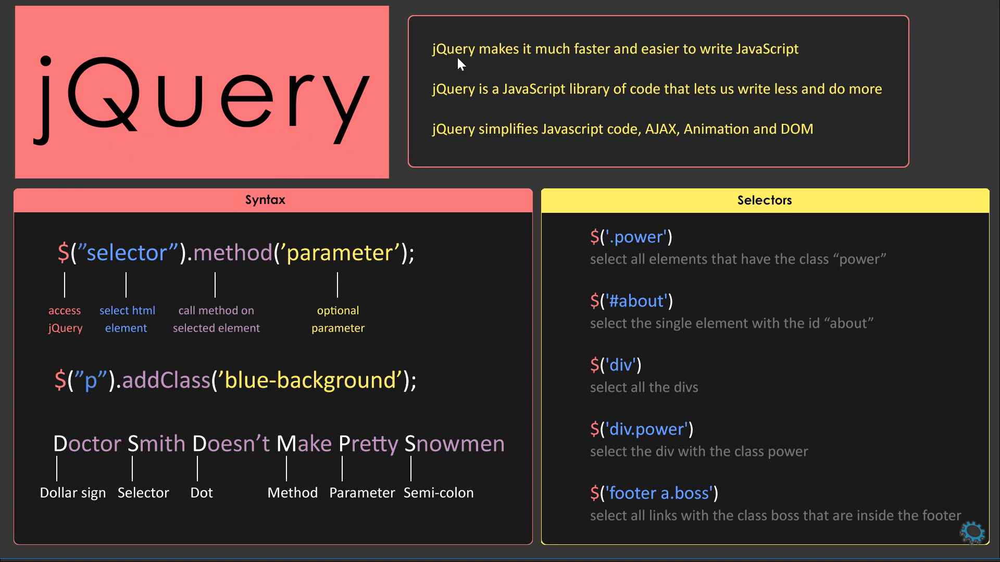
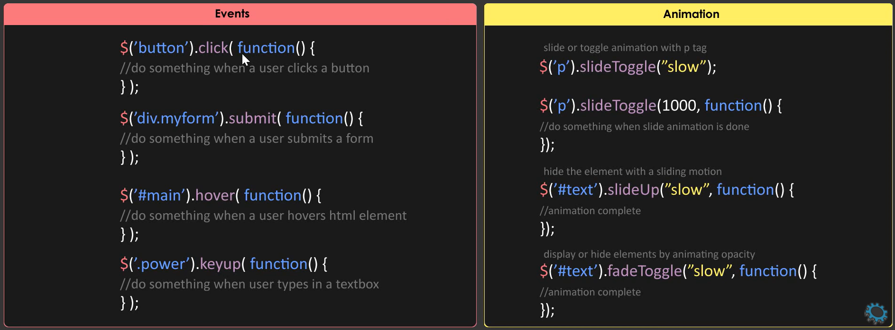

# JQuery

- Jquery is a `fast`, `easy` and `feature rich` javascript library.
- `Javascript` is a language and `jQuery` is a `library`.
- `Jquery` simplifies javascript, animations, ajax and DOM.
- `Jquery` only works for `HTML` document and do not works for `XML` document.
- Cross browser compatibility ( Work similar across all `browsers` )

### Features of jQuery 

`HTML` manipulation
- Jquery easily navigate throughout the structure of web page.
- It can easily change the web page contents, behaviours and elements.

`CSS` manipulation
- Supports CSS3 `selectors` and inline CSS manilpulation.
- It can easily change the design of a web page defined by CSS.

`Event Handling`
- Using Jquery we can trigger each events across all browsers.

`Effects` and `Animations`
- Jquery comes with a lot of predefined `effect` and `animation` methods.
- Improves the performance and user experience of a web page.

`AJAX`
- Provide simple methods to communicate with `servers` ( send and receive data )





### What is $() in JQuery ?

- `$()` is an alias of jquery `function`
- Used to wrap any object into jquery object which helps to call various methods.

```javascript
$(document).ready(function(){   // Starting point
$("p").css("color","pink");
});
```

### Data types 

Similar to `javascript`

```javascript
1. atring :  Series of characters enclosed in single or double quotes.
   let info = "This is a string";
   var message = 'This is a string';
   
2. number : All numerical formats ( Integer or floating point number )
   var age = 25; let weight = 55.5;
   
3. boolean : A logical entity.    
   let isSingle = true; 
   let isFather = false;

4. object : NULL - Implies nothing as a value.
   var money = null;   

   Object : Variable that can hold more than one values : Array, list and dictionaries.   
   let names = ['Kiran', 'Datta', 25, 35];
   
5. undefined : A variable with no assigned value.
   var money;
   
6. function : Block of code written to perform a specific task.
   // Function without argument.
   let sum(){
      return 2 + 3;
   }
   
   // Calling a function
   sum();
   
   // Function with arguments.
   let sum(a, b){
      return a + b;
   }
   sum(2, 3);
   
   // Self invoking function
   (sum(){
      return 2 + 3;
   })();
   
   // Scope
   Local scope :
   sum(){
      var i = 1;
   }
   
   Global scope:
   var i = 1;
   sum(){
      return 2 + 3
   }
```

### What is a CDN

- Content delivery network or Content distribution network.
- It provides files from servers that loads faster.
- `Google` and `Microsoft` provides free public CDN's. 
- `Microsoft` loads jquery from `AJAX` CDN.
- `Google` loads jQuery from Google libraries `API`.
- e.g. Javascript, CSS, Bootstrap and JQuery libraries CDN links are available.
- We can directly embbed the link of those CDN libraries directly from official website.
- But it requires real time internet connection, so we download the zip files.

```javascript
\\ CDN : jQuery library link which we copy directly from it's official website

<script src="https://code.jquery.com/jquery-3.1.0.min.js"></script>
```

### What is Javascript callback function in Jquery ?

- A callback function is also called as higher order function. 
- A function that is passed to another function as a `parameter`
- A callback function executes only after the base function is executed.

```javascript
$("#id").click(function(){
   // block of code
});

// Here first the click function is executed than the called function is executed.
```

### JQuery - Javascript builtin functions

```javascript
// Number methods :
1. toFixed() : Returns a number with fixed decimal places.
2. toString() : Convert a number to string.

// String methods :
1. toLowerCase() : Convert string to lower case.
2. toUpperCase() : Convert string to Upper case.
3. charAt() : Return character at specified index.
4. concat() : Join 2 or more strings.
5. indexOf() : Return index of passed value.
6. length() : Return string length.
7. slice() : Return a subset of string.
8. split() : Return array of strings.

// Array method :
1. forEach() : Calls a function for each element of array.
2. join() : Join all elements of array to form a string.
3. filter() : Filters based on condition and returns string.
4. reverse() : Invert the index of arrays.
5. sort() : Sort the elements of array.
```   

### Effects methods used in JQuery

1. `show()` : Display selected elements.
2. `hide()` : Hide selected elements.
3. `toggle()` : Toggle between two methods.
4. `fadein()` : Fades in selected elements.
5. `fadeout()` : Fades out the selected elements.
6. `fadeToggle()` : Toggle between `fadein()` and `fadeout()` methods.
7. `delay()` : Delay the executions of functions in the queue.

### What is DOM ?

- Document Object Model : Defines a logical structure of document.
- How the document can be accessed and manipulated.
- `DOM`is a tree of objects : Roots, nodes, elements and attributes.
- Browser creates a `DOM` when a web page is loaded.
- `DOM` can be easily accessed and manipulated using `javascript` and `jquery`

```html
<!DOCTYPE html>
<html>                             
   <head>
      <title>Page title</title>
   </head>
   <body>
      <p>First Paragraph</p>
      <p>Second Paragraph</p>
   </body>
</html>

Here html tag is a root node and head and body tags are it's element nodes.
```

### html() method

- Change the entire content of the selected elements.
- It replaces the selected element contents with new contents.

### css() method

- Used to `get` or `set` style properties or values for selected elements, tags or class.

### animate() method

- Apply custom `animation effect` to elements.
