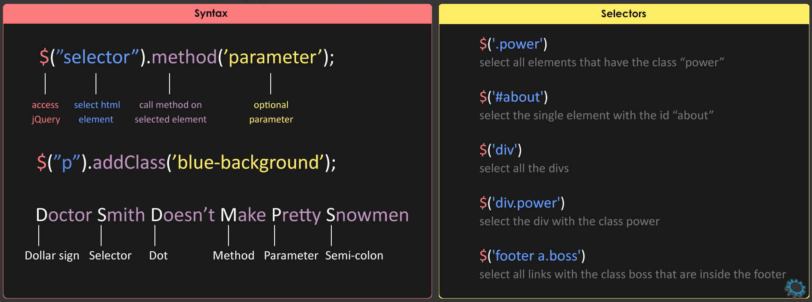

# JQuery

- Jquery is a `fast`, `easy` and `feature rich` javascript library.
- `Javascript` is a language while `jQuery` is a builtin `library`.
- `Jquery` simplifies javascript, animations, ajax and DOM.
- `Jquery` only works for `HTML` document and not for `XML` document.
- Cross browser compatibility ( Work similar across all `browsers` )
- `Jqery` is open source and free to use.

### What are features of jQuery ?

`HTML` manipulation
- Jquery easily navigate throughout the structure of web page.
- It can easily change the web page contents, behaviours and DOM elements.

`CSS` manipulation
- Supports CSS3 `selectors` and inline CSS manilpulation.
- It can easily change the design of a web page defined by CSS.

`Event Handling`
- Using Jquery we can trigger each events across all browsers.

`Effects` and `Animations`
- Jquery comes with a lot of predefined `effect` and `animation` methods.
- Improves the performance and user experience of a web page.

5. AJAX
- Provide simple methods to communicate with `servers` ( send and receive data )




### What is $() in JQuery ?

- `$()` is an alias of jquery `function`
- Used to wrap any object into jquery object which helps to call various methods.

```javascript
$(document).ready(function(){   // Starting point
$("p").css("color","pink");
});
```

### Effects methods used in JQuery

1. `show()` : Display selected elements.
2. `hide()` : Hide selected elements.
3. `toggle()` : Toggle between two methods.
4. `fadein()` : Fades in selected elements.
5. `fadeout()` : Fades out the selected elements.
6. `fadeToggle()` : Toggle between `fadein()` and `fadeout()` methods.
7. `delay()` : Delay the executions of functions in the queue.

### html() method

- Change the entire content of the selected elements.
- It replaces the selected element contents with new contents.

### css() method

- Used to `get` or `set` style properties or values for selected elements, tags or class.

### What is a CDN

- Content delivery network or Content distribution network.
- It provides files from servers at high bandwidth that leads to faster loading time.
- There are several companies that provide free public CDN's. (`Google`, `Microsoft` and `Yahoo`)
- `Microsoft` loads jQuery from `AJAX` CDN.
- `Google` loads jQuery from Google libraries `API`.
- e.g. We use JavaScript, CSS, Bootstrap and JQuery libraries CDN links instead of downloading the zip files.

```javascript
\\ CDN : jQuery library link which we copy directly from it's official website

<script src="https://code.jquery.com/jquery-3.1.0.min.js"></script>
```

### animate() method

- Apply custom `animation effect` to elements.
