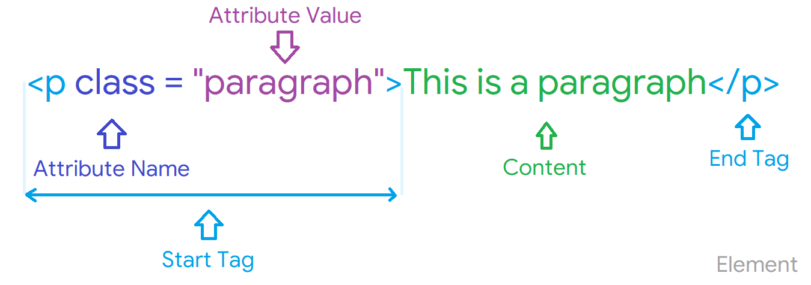

<p align=right><a href="https://github.com/KIRANKUMAR7296/Javascript/blob/main/jQuery.md">jQuery</a> | <a href="https://github.com/KIRANKUMAR7296/JavaScript/blob/main/AJAX.md">AJAX</a></p>  

# JavaScript

### What is JavaScript ?

- Most `popular` and `widely` used programming langauge in the world.
- It's growing `faster` than any other programming langauge.
- It is used for both `front-end` and `back-end` development.
- Javascript is all about `behaviour` (e.g. How your web page behave when you hover mouse over an element)
- Javascript can change `HTML` content and properties (e.g. Show or Hide, Change color or size)
- Javascript accepts both double quotes `""` and single quotes `''`.
- Javascript is a `dynamically` typed language (Data type of a variable is checked during `run time`)
- All the statements in javascript should end with `;` (semicolon)
- `//` (double forward slash) represents `comments` in javascript. 



### Why do we use JavaScript ?

- First javascript was only used in browser to build `interactive web pages`
- Now `web`, `mobile` and `real time networking` apps (social media) are created using javascript.
- Real time networking (Apps that runs only on internet connection : YouTube, Instagram, Facebook, etc)
- Now javascripts are also used for creating `games`

### Where does JavaScript runs ?

- Javascript was orignally designed for running only on `browsers`
- So every browser has a `javascipt engine` that executes javascripts.
- But later javascript engine was embedded inside c++ and was named `node js` which can be used outside browsers.
- node js includes Google's javascript engine because of which we can build web and mobile apps.

### What is ECMA ?

- ECMA defines `standards` and `specifications`
- Now it is called as `ES6`, it defines many new features for javascript.

### Where should we write JavaScript codes ?

- Javascripts are written inside `<script>` tag.
- It can be written inside `<head>` tag or `<body>` tag.
- But the best place to write javascript code is at the end of `<body>` section (After all elements)

```html
<body>
  <h1>Heading</h1>
  <div>...</div>
  
  <script>All the javascript codes should be written at the end of body.</script>
</body>
```

### Why it is better to place script tag at the bottom of head section ?

- Because the browser reads the page from top to bottom (line by line)
- So if the codes are in `<head>` tag, browser will take time to parse code and display contents.
- User will feel that the browser is loading `slow` and it will create a bad user experience.
- Therefore it should be placed at the end, then browser will load the `contents` first and then will parse js.
- Javascript code consists of some functions that interacts with elements on page, so it takes time to read.
- but there are certain exceptions that dominates to keep the `<script>` in `<head>` section.

### Data types in JavaScript

We can declare variable using a keyword `var` or `let` 
  
```javascript
-------------------------------------------------------------------------------------------
// A.Primitive | Value types
-------------------------------------------------------------------------------------------
// 1.String
let name = "Kirankumar";            

// 2.Number
let age = 25;                       # 

// 3.Boolean
let ismale = true;

// 4.Undefined
let mail;  

// 5.Null
let x = null;
-------------------------------------------------------------------------------------------
// B.Reference type
-------------------------------------------------------------------------------------------
// 1.Object : Collection of data     

// List Array
let array = [5, "Hi", true, 7.7];  // Heterogeneous : Mixed values of different data types.
let colors = ['R', 'G', 'B'];      // Homogeneous : Values of only one data type.

// Access or Update ( Values are accessed or updated using index locations )
colors[0]
colors[3] = 'Y'

// Dictionary Array {key : value}
let person = {                  
  name : 'Kirankumar',
  age : 30
};

// Access or Update
// A.Dot Notation
person.name 
person.name = 'Kiran'

// B.Bracket Notation
person['age']
person['age'] = 26

// 2.Function
function greet(firstName, lastName){                   
  console.log('Hello ' + firstName + ' ' + lastName);
}

// * No need to end the function declaration with ';' semicolon.

// Call a function
greet(firstName='Kirankumar', lastName='Yadav');

function square(number){
  return number * number
}
square(2)
```

### How to check data type of variable ?

```javascript
typeof variable :  Outputs :
------------------------------
typeof name        "string"  
typeof age         "number"
typeof isMale      "boolean"
typeof mail        "undefined"
typeof x           "object" 
```

### How to declare a constant in JavaScript ?
  
```javscript
const pi = 3.14
```

### Static vs Dynamic language ?

- `Static` : We declare the variable with it's data type and it cannot be changed further.
- `Dynamic` : We don't need to declare variable with data type and it can change it's value at the runtime.

### What is Separation of concerns ? 

- Javascript code should be written in seperate page with `.js` extension.

```javascript
<script src='index.js'></script>  
```
  
- In same way CSS is also written on another page it is just called on html page.
- It helps to keep the page clean. 
 
### What is Hoisting ?
- `Default` bahaviour of Javascript where all the `Variables` and `Functions` declarations are moved on the top. 

### Difference between "==" and "==="

```javascript
var x = 2;
var y = "2";
`x == y`       // Return true since x and y are same.
`x === y`      // Return false since typeof x is "Number" and typeof y is "String".
```
### Implicit Type conversion in JavaScript
- `Automatic` conversion of value from one data type to another.

```javascript
var x = 3;
var y = "3";
x + y         
// Output : "33"

var x = 25
var y = "Hi"
x + y         
// Output : "25Hi"
```

### Static vs Dynamic Typing

Static typing
```c#
string name;
name = "Kirankumar";
```

Dynamic typing
```javascript
var name;
name = "Kirankumar";
name = 7;
```

Static | Dynamic
:--- | :---
Variables have types | Variables have no types
Values have types | Values have types
Variables cannot change type | Variables changes data type 

### Type of NaN

NaN represents Not a Number.

```javascript
typeof NaN      // Number
```

### Explain Pass by Value and Pass by Reference

```javascript
var x = 2;
```

A Variable `x` is created and assigned it a value `2`, In background the `=` allocates some space in memory. Stores value `2` and returns the location of the allocated memory space.

Variable `x` points to the location of the memory space instead of directly pointing to value `2`.

### Explain call() vs apply() methods.

`call()` : Invokes a method (function) by specifying the object.

```javascript
function greet(){
  return "Hello" + this.name;
}

var obj = {name : "Kirankumar"};
greet.call(obj);  

# Output :
Kirankumar
```

`apply()` : Takes Arguments as an array.

```javascript
function greet(){
  return "Hello" + this.name;
}

var obj = {name : "Kirankumar"};
greet.apply(obj,["Awesome"]);  
```

### Scope and Scope Chain 

`Global Scope` : All the variables and functions can be accessed from anywhere inside the code.

`Local` or `Function Scope` : All the variables declared inside the function can be only accessed from inside that function.

`Block Scope` : Variables declared using `let` and `const`, can be accessed only inside that block (Inside the `{ }`)

### What are Object Prototype

- A `Prototype` is a Blueprint of an object.
- Prototype allows us to use `Properties` and `Methods` on an object.

### Memoization

- Form of `Caching` where the return value of Function is cached.

### What is the use of a Constructor function

- Constructor functions are used to create `objects`.
- Constructor can create multiple instances having similar `properties` and `methods`.

### What is DOM : Document Object Model

- A Programming Interface for `HTML` and `XML` documents.
- When the browser tries to render `HTML` document.
- It creates an object based on `HTML` document called `DOM`.
- Using `DOM` we can manipulate or change various elements inside the `HTML` document.

### What are Generator Functions ?

- A special `class` of functions.
- They can be stopped `midway` and then continue from where it had stopped.
